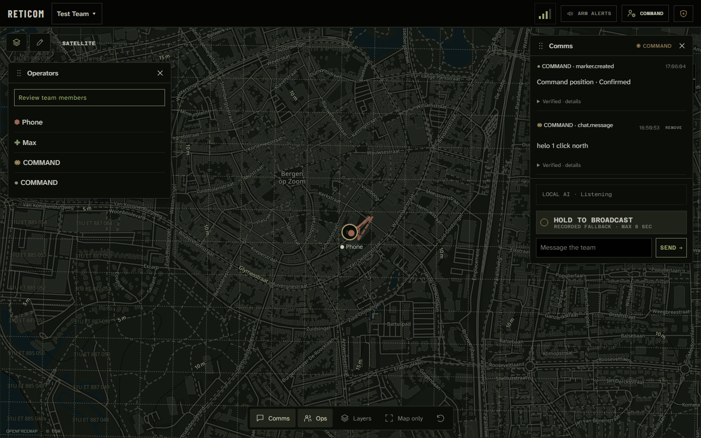
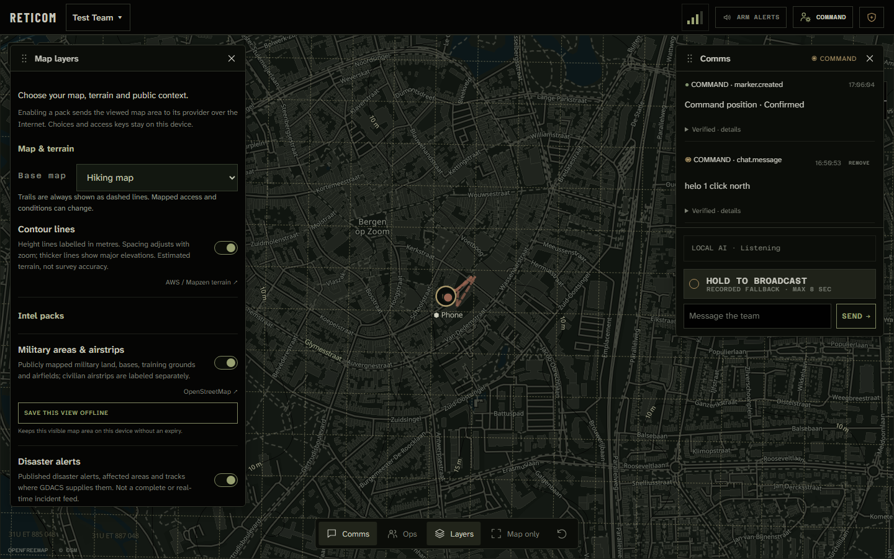

# RETICOM

<p align="center">
  <strong>Map-first team communication over Reticulum.</strong><br>
  A focused Android field app and Windows command workspace for teams that need maps, voice, text and shared operational context across whatever links are available.
</p>

<p align="center">
  <a href="https://github.com/m-a-x-s-e-e-l-i-g/Reticom/releases/latest"><strong>Download Android + Windows</strong></a>
  · <a href="#run-it-locally">Run locally</a>
  · <a href="docker/README.md">Docker guide</a>
</p>



<p align="center"><sub>Command turns the map into a movable workspace: operators on the left, verified communications and PTT on the right, shared position in the middle.</sub></p>

## Highlights

- **Two purpose-built apps**
  - **Field for Android:** a map-first, one-handed client for people on the move.
  - **Command for Windows:** a wide common-operating-picture workspace for coordinating one or many teams.
  - Shared event formats, map objects, identities and transport behavior across both apps.

- **Team communication in one place**
  - Team text chat.
  - Private text chat between verified operators.
  - Team push-to-talk from Field or Command.
  - Private PTT to an individual operator.
  - Live low-bitrate voice when the route supports it.
  - Reliable recorded fallback clips of up to **8 seconds** when live voice is unavailable.
  - Local Whisper transcription in Command.
  - Android text-to-speech for messages, tasks and private communications.
  - Optional audio autoplay and radio-style incoming alerts.
  - Persistent local outbox: messages, PTT clips and map work can be created offline and delivered later.
  - Delivery states that distinguish **saved locally**, **queued**, **delivered** and **cryptographically proven**.
  - Expandable sender identity, signature, packet hash, proof and receiving-interface details.
  - Routine location updates stay out of the Intel feed so conversations remain readable.

- **A shared tactical map**
  - Live operator positions with callsign, symbol, color and last activity.
  - Accuracy-weighted movement trails with bad-fix rejection and jump quarantine.
  - MGRS/UPS grid worldwide, including copyable grid references.
  - Numeric compass, waypoint bearing and contact bearing.
  - Live phone-facing direction for deliberate pointing.
  - Dark hiking/vector map for low-light use.
  - Satellite view for current visual context.
  - Metre-labelled contour lines rendered locally from cached elevation tiles.
  - Trails, paths, peaks, parks and labels from the vector basemap.
  - **34 manual tactical marker types** across operations, medical, control, threat, hazard, support and unit categories.
  - Notes, warnings, observations, waypoints, arrows, freehand traces, areas and route objects.
  - Signed creation, update, clearance and deletion events.

- **Navigation that stays connected to the team picture**
  - Direct-line navigation to operators and waypoints.
  - Calculated walking routes using a real foot-routing graph.
  - Calculated driving routes with direct-line fallback.
  - Offline walking and driving when a compatible routing region is installed.
  - Explicit route sharing: teammates can view or follow the exact selected geometry.
  - Shared routes do not silently recalculate into something different on another device.
  - Driving alternatives are checked against connected full-road-closure geometry before selection.
  - Clear warnings when no supplied alternative avoids every reported closure.
  - Accuracy-aware arrival detection rather than a fixed, overconfident radius.

- **Public Intel Packs beside verified team reports**
  - OpenStreetMap military areas, bases, training grounds, airfields and airstrips.
  - GDACS disaster alerts, affected areas and tracks.
  - NASA FIRMS VIIRS thermal anomalies with a selectable time window.
  - ACLED conflict and protest reports with the operator's own authorized token.
  - Live aircraft with callsign, altitude, direction, classification and type filters.
  - Live boats and ships with AIS identity, vessel type, classification and track history.
  - Road closures, restrictions and incidents from official NDW and NCDOT feeds.
  - Per-layer filters and credentials saved only on the local device.
  - Bounded local caches that preserve visited geometry while panning, zooming or losing a provider.
  - Explicit **stale**, **partial**, **truncated** and **uncovered** states instead of pretending missing data means safety.
  - Public provider data remains visually and technically separate from signed team Intel.

- **Natural speech and text can become grounded map reports**
  - Command transcribes incoming PTT locally.
  - A local Ollama model interprets paraphrases and multiple observations without a cloud AI API key.
  - The model returns structured references, never arbitrary coordinates.
  - Application code validates marker type, distance, direction, recency and source position.
  - Named landmarks can be resolved through bounded OpenStreetMap lookup near a recent team position.
  - Ambiguous, stale or unresolved reports remain messages; Reticom does not invent a pin.
  - Automatic markers keep their originating message or broadcast and expire according to report type.
  - Duplicate retries resolve to stable marker IDs.

- **Teams are identity-based, not callsign-based**
  - Every Field and Command installation has a persistent Reticulum identity.
  - Join by checksummed code, QR scan or a recently heard team announce.
  - A join code locates the team; it does not bypass membership approval.
  - Owners can compare full device identities through a trusted channel before approval.
  - Approval, rejection, revocation and complete operator/history removal are distinct actions.
  - Callsigns, icons and colors are friendly labels; the identity hash is the cryptographic anchor.
  - Optional shared-admin mode permits approved members to manage team content.
  - The local device cannot accidentally remove itself as the last trusted control point.

- **Offline and disrupted-network behavior is designed in**
  - Local GPS and downloaded maps continue without a team host or Internet.
  - Outgoing events are stored immediately before delivery is attempted.
  - Only the newest unsent position fix is retained during extended offline movement.
  - Late joiners retrieve current markers, drawings, tasks, routes, profiles, recent Intel and their own private mailbox.
  - Interrupted mission snapshots resume and apply transactionally only after their digest is verified.
  - Optional trusted backup hosts can replicate team state and take over after host loss.
  - Deletion tombstones prevent old packets or stale snapshots from resurrecting removed content.

## Field: the operator app

<p align="center">
  
  
  
</p>

Field keeps the highest-frequency actions close to the map:

- Long-press anywhere on the map to open the radial action menu.
- Add a marker, waypoint, note, arrow, area or freehand drawing without leaving the map.
- Hold PTT below the map or beside the Intel composer.
- Swipe away a still-buffered recording to cancel it.
- Read recent incoming messages above the map; outgoing history stays in Intel.
- Open **Ops** for verified teammates, private chat/PTT, navigation and shared routes.
- Keep the numeric compass, MGRS reference, connection quality and active bearing visible at a glance.
- Share location independently from sharing phone-facing direction.
- Use local maps, grid, own GPS and queued work when disconnected.
- Receive TTS/audio alerts through the Android foreground service while operating in the field.

<p align="center">
  
  
  
</p>

## Command: the coordination workspace

Command uses the map as a desktop canvas instead of forcing the operator through separate pages:

- Open or close **Comms**, **Operators**, **Tasks** and **Map layers** from the bottom dock.
- Drag panels to suit the current operation.
- Move panels with the keyboard when pointer dragging is inconvenient.
- Use **Map only** for an unobstructed common operating picture, then restore the previous layout.
- Keep each team's layout and camera independent.
- Host multiple teams, join teams hosted elsewhere, pause synchronization or keep them syncing in the background.
- Open **All Teams** for a combined map and Intel overview without merging team identities or histories.
- Send team text and PTT directly from the communications panel.
- Inspect verified event provenance without leaving the feed.
- Manage operators, modules, join codes, QR pairing and permissions from the same workspace.
- Set a fixed Command position per team for grounded reports such as `Helo 1 click north`.
- Run local speech interpretation for teams hosted on this Command or another trusted host.
- Clear communications without deleting the map, tasks or operator directory.

## Maps and Intel Packs



<p align="center"><sub>Every external layer is opt-in, source-labelled and kept separate from cryptographically verified team events.</sub></p>

### Map choices

- **Hiking map**
  - Dark vector cartography.
  - Roads, paths, trails, labels, peaks and parks.
  - Compatible with downloaded offline vector tiles.

- **Satellite map**
  - Online imagery for rapid visual orientation.
  - Team overlays, trails, markers and grid remain visible above it.
  - Bulk offline satellite storage is intentionally unavailable because of provider restrictions.

- **Terrain contours**
  - Height lines labelled in metres.
  - Major/minor spacing adapts to zoom.
  - DEM tiles are cached locally and converted to contours on the device.
  - Useful context, not survey-grade elevation.

- **MGRS/UPS overlay**
  - Works independently of the Internet.
  - Covers polar UPS as well as normal MGRS zones.
  - Centre reference is copyable from both clients.

- **Offline map packs**
  - Save visible vector tiles and common label glyphs.
  - Up to 2,500 tiles per download.
  - Identities, team overlays, grid and local work remain available alongside the pack.

- **Offline routing packs**
  - Separate from map-image downloads.
  - Local walking and driving calculation with no Internet route request.
  - **Offline first** prefers installed data and falls back online when needed.
  - **Offline only** never sends route coordinates to an Internet routing service.

### Intel Pack choices

- **Military areas & airstrips** — public OSM geometry for military land, bases, training areas, military airfields and separately labelled civilian airstrips.
- **Disaster alerts** — earthquakes, cyclones, floods, wildfires, volcanoes and tsunamis from GDACS, with reported shapes/tracks when provided.
- **Satellite heat detections** — NASA FIRMS VIIRS observations for 24 hours, 3 days or 7 days; a thermal anomaly is not treated as a confirmed fire or attack.
- **Conflict & protest reports** — ACLED events from the latest 30 days, preserving report date and location precision.
- **Road closures & disruptions** — full closures, restrictions, works, accidents, obstructions and weather/flood reports with type and impact filters.
- **Live aircraft** — regional ADS-B positions with classification/type filters, bounded estimated motion and on-demand recent tracks.
- **Live boats & ships** — AIS positions with classification/type filters, bounded estimated motion and on-demand recent tracks.
- **Save this view offline** — retain visible public geometry on this device without an expiry where the source permits it.

See [public providers and privacy](docs/intel-providers.md), [public-layer caching](docs/public-layer-cache.md), [live traffic](docs/live-traffic.md), [road disruptions](docs/road-disruptions.md) and [terrain contours](docs/elevation.md).

## From a report to the map

Examples the report engine understands include:

- `Contact north 100 meters` → contact marker and bearing from the reporter.
- `Heat signature spotted 200 metres north of my position` → projected thermal/contact observation.
- `Rally 100m north` → rally point from a recent sender fix.
- `Rally half a klick north` → the same grounded distance using radio phrasing.
- `Let's meet by the nearest church` → local landmark resolution within a bounded search.
- `Road blocked 200 metres east` → obstacle and route warning.
- `Casualty at my position` → medical marker with reporter and time.
- `Need evacuation here` → EVAC marker.
- `Landing zone clear, 300 metres south` → LZ with status and bearing.
- `Possible movement northwest` → uncertainty sector rather than false precision.
- `Drone spotted west, 500 metres` → UAV observation and bearing.
- `Radio dead zone here` → communications warning.
- `Supply cache at this location` → logistics marker.
- `Route Alpha compromised` → named route warning.
- `Search this area` → search-area geometry.
- `Cancel last contact` → clears that speaker's latest matching automatic report.

Distances accept compact/spaced metres, kilometres and clicks/klicks, including decimals. Explicit distances must include a direction and remain within the configured 1–5,000 metre bound. Projection normally requires the reporter's position from the last ten minutes. Landmark failure leaves the report visible without fabricating geometry.

## How team connectivity works

Reticom is transport-aware but transport-agnostic: the application creates the same signed events whether the available Reticulum path uses local Wi-Fi, Ethernet, an Internet-connected transport node or a configured radio bearer.

1. **Create or join**
   - A Command or Field node creates a team destination and becomes its owner/host.
   - Other devices locate it through a join code, QR code or recent Reticulum announce.
   - The owner verifies and approves each persistent device identity.

2. **Create locally first**
   - Text, audio metadata, map objects, tasks, routes and fixes are normalized and saved on the sending device.
   - Offline work receives a local/queued state instead of disappearing.

3. **Find any valid Reticulum path**
   - Same-LAN devices can discover paths through AutoInterface.
   - Remote devices can route through configured/community TCP transports over 4G/5G or fixed Internet.
   - LoRa/RNode uses the same application events when a compatible `RNodeInterface` and reachable path are configured.
   - Reticulum chooses the path; the UI does not need a different workflow for every bearer.

4. **Authenticate and deliver**
   - The sender opens an identified, encrypted Reticulum Link/Channel to the team host.
   - The host validates membership, sender identity, signature, event type, shape and size.
   - Accepted events are stored in the verified SQLite feed and acknowledged.
   - The sender changes queued content to delivered/proven only after the relevant acknowledgement/proof.

5. **Catch up**
   - Recipients retrieve new team events, private mail, tasks, recordings and current mission state.
   - Partial mission snapshots are staged and never replace the last complete local picture.
   - A trusted backup host can replicate state asynchronously and serve approved members if the preferred host disappears.

What is required:

- A Reticulum path between each Field node and the active team host.
- An active Command or Field host for cross-device team exchange.
- Internet only for Internet transports, online routing, satellite imagery and enabled public-data providers.
- No VPN or Tailscale requirement.
- No central Reticom SaaS account or cloud database.
- No assumption that a community transport node is always available.

## Reticom and ATAK

Reticom is not an ATAK clone and is not CoT/TAK-server compatible. It is a smaller, opinionated alternative for teams that value Reticulum-native store-and-forward behavior, integrated voice and a simpler combined Field/Command workflow.

### Where Reticom can be the better fit

- **Built-in PTT and voice fallback**
  - Team and private PTT are core features.
  - Live voice falls back to reliable short clips within the same hold.
  - Local transcription and Android TTS are part of the workflow.
  - TAK's own product material says ATAK includes chat but does not include built-in voice; voice commonly comes from plugins or external radio systems.

- **Reticulum-native connectivity**
  - Persistent cryptographic identities and destinations are fundamental, not added by an account layer.
  - The same application events can move over LAN, Internet transports and Reticulum radio interfaces.
  - Local queueing, later delivery and explicit proofs are visible to the operator.
  - No TAK Server deployment is needed; the team still needs an active Reticom host.

- **Focused user experience**
  - One map-first Android workflow instead of a broad plugin platform.
  - One movable Windows Command canvas instead of a separate general-purpose toolkit.
  - Team comms, PTT, tasks, map editing, local AI and public context use one consistent interaction model.
  - Fewer configuration surfaces can mean faster onboarding for a small team with a defined mission.

- **Local-first AI and privacy boundaries**
  - Whisper transcription and Ollama interpretation run locally.
  - The language model never chooses raw coordinates.
  - Public providers receive only the minimum request relevant to their layer; team history and identities are not sent with those requests.

- **Honest degraded-state handling**
  - Queued work remains visible as queued.
  - Public feeds expose stale/partial/uncovered states.
  - Failed landmark resolution creates no fake pin.
  - Mission snapshots apply only when complete and verified.

### Where ATAK/TAK is stronger

- A much larger, mature ecosystem of official and mission-specific plugins.
- Broad Cursor-on-Target interoperability with existing TAK deployments.
- Established TAK Server federation, data packages and enterprise deployment patterns.
- More platform variants, including ATAK, WinTAK, TAKX, iTAK, WebTAK and specialist clients.
- Richer integrations for video, sensors, radios and established operational systems.
- A far larger installed base, training ecosystem and organizational support footprint.
- Better fit when interoperability with an existing TAK network is mandatory.

The practical choice:

- Choose **Reticom** for a compact Reticulum-native stack, integrated voice, local-first operation and a deliberately narrow Field/Command experience.
- Choose **ATAK/TAK** when CoT interoperability, plugin breadth, video/sensor integration, mature federation or existing TAK infrastructure matters more.
- Do not treat either product as certified for a mission merely because it can display a tactical map.

Comparison references: [official TAK overview](https://tak.gov/), [official TAK products and TAK Server description](https://tak.gov/products), and [official TAK communication/plugin overview](https://tak.gov/solutions/military).

## Technical details

### Networking, storage and trust

- Field and Command are independent nodes with separate persistent identities, Reticulum configuration and local databases.
- Windows development uses a real `TCPClientInterface → TCPServerInterface` carrier at `127.0.0.1:4242`; it does not shortcut events between the two HTTP UIs.
- Separate devices use AutoInterface on reachable Ethernet/Wi-Fi and configured TCP or radio paths beyond the LAN.
- Android includes a multi-region community bootstrap pool; **Advanced Network** accepts a trusted custom node.
- Network events expose verified sender identity, packet hash, delivery proof and receiving interface.
- Application deletions use signed tombstones.
- Command is a trusted mailbox/relay for offline recipients.
- Private text/PTT is displayed only to sender and addressed Field identity, but **Command can process its contents; this is not host-blind end-to-end encryption**.
- Public TCP entrypoints can observe IP addresses, timing and traffic volume, but not protected application payloads.
- Provider credentials, map choices, TTS voices, transcription caches and downloaded maps stay device-local.
- The local HTTP/WebSocket control plane must remain loopback-bound or otherwise private; do not expose it directly to an untrusted network.

Current prototype limits:

- Community transport nodes can disappear without notice.
- Backup replication is asynchronous; the latest disconnected changes may be missing during takeover.
- The original owner is still required for new membership approvals.
- Formal group rekeying, managed key recovery and production deployment hardening remain outside this prototype.
- Native Bluetooth proximity requires a real Reticulum-capable bearer; it is not simulated.
- Satellite imagery is online-only.
- Reticom does not provide CoT/TAK interoperability, video streaming or the breadth of ATAK's plugin ecosystem.

### Audio and transcription

- Live team PTT uses an authenticated Channel and low-bitrate Opus/WebM fragments.
- If the live route disappears, the same hold falls back to reliable clips of up to **8 seconds**.
- Swiping cancels buffered recording or stops future live audio; already received audio cannot be recalled.
- Command runs `faster-whisper` locally and caches results by audio hash.
- The default transcription language is English because short-clip language detection can be unreliable.
- Command can pass grounded structured references to a local Ollama model; speech audio and text do not go to a cloud model.

```powershell
$env:RETICOM_TRANSCRIPTION_LANGUAGE = "nl"   # Dutch; default: en
$env:RETICOM_TRANSCRIPTION_LANGUAGE = "auto" # Automatic detection
$env:RETICOM_TRANSCRIPTION_MODEL = "base"    # Default Whisper model
```

See [transcription](docs/transcription.md), [local speech interpretation](docs/speech-markers.md) and [automatic marker rules](docs/automatic-markers.md).

### Position, trail and offline rules

- Position sharing is at most every **15 seconds** while moving, with a **60-second** stationary heartbeat.
- Sharing rejects accuracy worse than **100 metres**.
- Own GPS still appears locally while offline without automatically becoming a delivered team fix.
- Trails reject fixes worse than **150 metres** and quarantine implausible jumps until a second consistent fix arrives.
- Trails keep at most **48 points / 30 minutes** and hide **10 minutes** after the latest fix.
- Routine fixes do not enter Intel; `OPERATOR ACTIVE` appears only after sharing resumes following more than one hour.
- Arrival uses an accuracy-aware radius of at least **35 metres** and ignores fixes worse than **75 metres**.
- New online routes send origin/destination to the selected routing provider.
- Following an already shared route does not generate a new provider request.

See [offline navigation](docs/offline-navigation.md), [shared navigation](docs/shared-navigation.md) and [live pointing](docs/live-pointing.md).

## Run it locally

### Windows

Requires **Python 3.11+ and PowerShell**.

```powershell
py -m venv .venv
.\.venv\Scripts\python -m pip install -e .
.\start-local.ps1
.\smoke-test.ps1  # Field → Reticulum → Command signed round-trip
.\stop-local.ps1
```

Then open:

- **Command:** <http://127.0.0.1:8780>
- **Field:** <http://127.0.0.1:8781>

The smoke test waits for its exact event and reports delivery, RTT, bytes, sender identity, packet hash and receiving interface. Runtime files and logs live in `runtime/`; startup refuses occupied application/carrier ports.

For local speech interpretation:

```powershell
.\start-local-ai.ps1
```

This starts the local Ollama service and downloads the default model. Docker retains it in the `language-models` volume.

### Docker

Requires **Docker Desktop using Linux containers** or Docker Engine with Compose.

```sh
docker compose up -d --build --wait
docker compose stop
```

Then open:

- **Command:** <http://localhost:8780>
- **Field:** <http://localhost:8781>

Each container runs a real Reticulum node connected over TCP. Separate volumes preserve identities, teams, audio, public-data caches and offline maps across rebuilds. Existing Windows/Android data is not imported. See the [Docker guide](docker/README.md) for ports, phone access, transcription and development.

## Build the apps

### Android Field

Requires **Windows, WSL 2 and an ARM64 phone running Android 8.0+**. The first build downloads isolated Java, Python, Gradle and Android SDK tooling into WSL.

```powershell
.\build-android.ps1
.\build-android.ps1 -TransportHost rns.example.org -TransportPort 4242
.\build-android.ps1 -VersionName 0.2.1 -VersionCode 2001
```

**Field Settings → Advanced Network** can also set a hostname/IP and port after installation while retaining community fallback. Fully restart Reticom after changing network settings.

The internal Python package, Android application ID, browser storage keys and destination aspect retain `retium` for compatible in-place upgrades that preserve identity, team route and settings.

### Windows Command

Requires **Windows and Python 3.11** to build; end users need no Python installation. The standalone application bundles Python, FastAPI, Reticulum and the Command UI while using the installed Microsoft Edge WebView2 runtime.

```powershell
.\build-windows.ps1 -Version 0.2.1
```

Output: `dist/Reticom-Command-0.2.1-windows-x64.exe` plus SHA-256. Identities, team data, offline maps and logs live in `%LOCALAPPDATA%\Reticom`, not beside the executable.

## Development

<details>
<summary>Source layout</summary>

- `src/retium/server.py` — FastAPI, HTTP/WebSocket API and role startup.
- `src/retium/protocol.py` — event validation, normalization and size limits.
- `src/retium/transport.py` — destinations, Links, delivery and receiving.
- `src/retium/live_voice.py` — authenticated live PTT Channel.
- `src/retium/store.py` — verified SQLite event store and tombstones.
- `src/retium/outbox.py` — persistent Field queue and delivery state.
- `src/retium/team.py` — teams, announces, joining and modules.
- `src/retium/membership.py` — signed approvals, revocation and removal policy.
- `src/retium/mission.py` — paged mission snapshots and catch-up.
- `src/retium/continuity.py` — trusted backup-host replication.
- `src/retium/tasks.py` — shared assignments.
- `src/retium/ptt.py` — recorded audio and metadata.
- `src/retium/transcription.py` — local Whisper processing and cache.
- `src/retium/speech_markers.py` — local language-model interpretation and grounded marker publication.
- `src/retium/intel_packs.py`, `intel_sources.py` — public-layer catalogue, adapters, caching and endpoints.
- `src/retium/traffic.py`, `road_disruptions.py` — aircraft, vessel and road-report normalization.
- `src/retium/offline_maps.py`, `offline_routing.py` — local map and route packs.
- `src/retium/static/app.js`, `index.html`, `styles.css` — shared Field/Command client.
- `src/retium/static/command-workspace.js` — movable desktop Command canvas.
- `src/retium/static/automatic-reports.js`, `marker-catalog.js` — report geometry and manual markers.
- `src/retium/static/location-filter.js`, `route-navigation.js` — GPS filtering and in-app routing.
- `android/app/src/main/java/com/retium/field/` — native WebView, foreground service, location and TTS.
- `android/app/src/main/python/mobile_main.py` — standalone on-device server.
- `windows/`, `scripts/`, `configs/`, `tests/` — packaging, tools, node configs and verification.

</details>

### Tests

```powershell
.\.venv\Scripts\python.exe -m pip install -r requirements-dev.txt
.\.venv\Scripts\python.exe -m pytest -q
node --test tests/*.test.mjs
.\smoke-test.ps1
```

Coverage includes protocol/signatures/packet limits/tombstones, membership, operator removal, mission catch-up, continuity, tasks, private mailboxes, audio, automatic reports, all **34 manual marker types**, GPS filtering, map preservation, MGRS/UPS, traffic, road disruptions, navigation and Command workspace behavior.

Android changes also require a real build, `adb install -r` and physical-device checks for permissions, foreground service, native TTS, microphone and background alerts. Browser tests cannot verify those native behaviors.

### Releases

Push an unused `vMAJOR.MINOR.PATCH` tag. GitHub Actions builds versioned Android and Windows packages in parallel, runs browser/Python tests and the frozen Windows backend smoke test, then publishes both binaries and SHA-256 files together.

```powershell
git tag v0.2.2
git push origin v0.2.2
```

The tag sets Android `versionName`; `versionCode = major × 1000000 + minor × 1000 + patch`. Never reuse a release tag.

## Status and license

Reticom is a working vertical slice and field prototype running on real Reticulum infrastructure and Android hardware. It is **not a certified command-and-control, emergency-dispatch, navigation or safety product**. Public layers are incomplete context, not authoritative intelligence.

Copyright © 2026 [m-a-x-s-e-e-l-i-g](https://github.com/m-a-x-s-e-e-l-i-g). [CC BY-NC-ND 4.0](LICENSE): sharing requires attribution, noncommercial use and no distribution of modified versions. See `LICENSE` for the full terms.

Bundled components retain their own licenses, including **geographiclib-mgrs — MIT**, **MapLibre GL JS — BSD-3-Clause**, **maplibre-contour — BSD-3-Clause** and the bundled Valhalla components documented beside their source.
