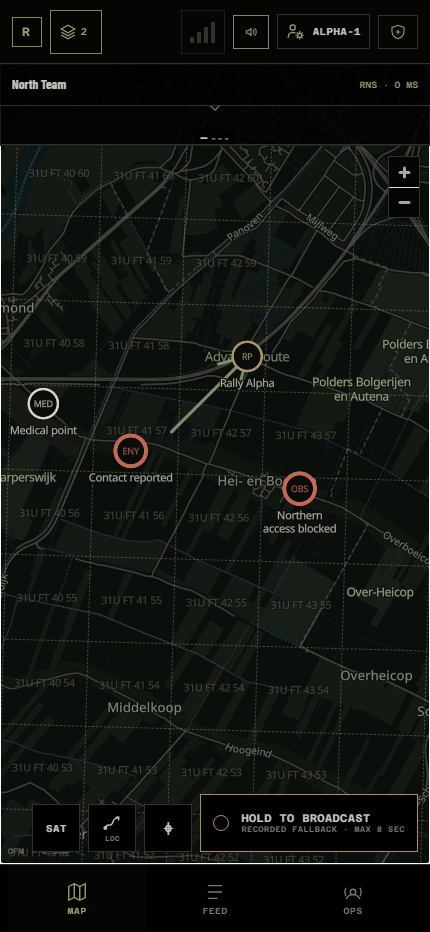
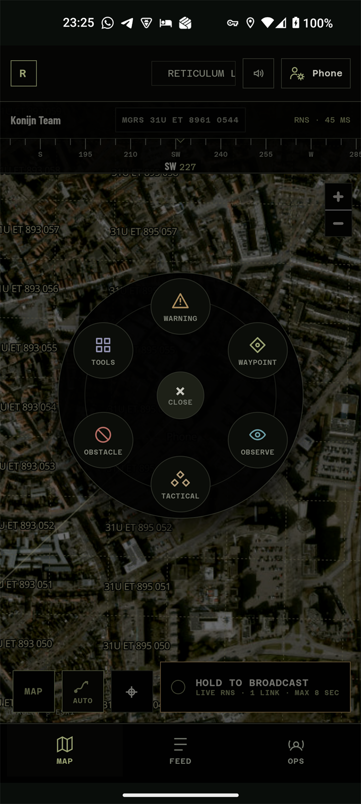
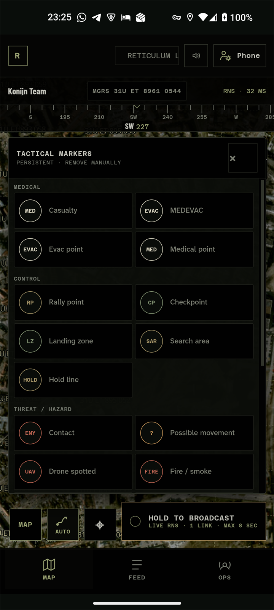
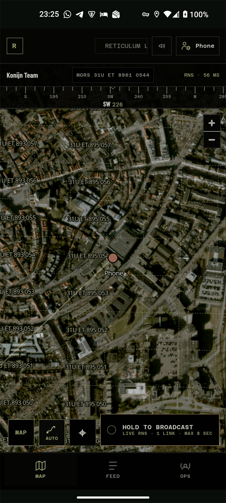
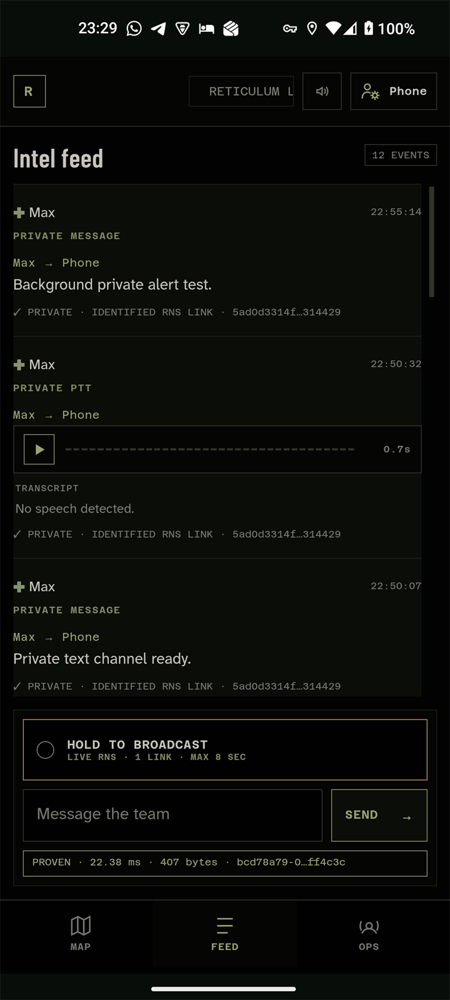
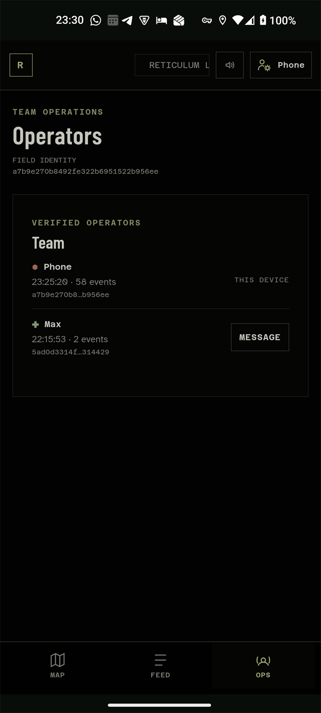

# RETICOM

<p align="center">
  <strong>Map-first team communication over the real Reticulum network.</strong><br>
  Location, push-to-talk, messaging and tactical information for Android and desktop.
</p>

<p align="center">
  
  
  
  <br><sub>Live contact projection · quick map actions · 22 tactical marker types</sub>
</p>

**Field** puts maps, PTT and team information on a phone. **Command** provides the desktop overview, team management, messages, audio, tasks and map editing. The interface is dark for night/OLED use and designed for quick, one-handed operation.

Reticom uses real Reticulum identities, destinations, announces, Links, Channels, signatures and delivery proofs. Everything displayed is received or created locally; there are no simulated peers or sample data. Local Wi-Fi, Reticulum routes over 4G/5G and downloaded maps allow operation without a central SaaS backend.

[Download Android / Windows](https://github.com/m-a-x-s-e-e-l-i-g/Reticom/releases/latest) · [Docker guide](docker/README.md)

## Using Reticom

1. **Create or join a team.** Command and Field can host. Field joins through a checksummed code, local QR scan or recent reachable team announce. The host becomes admin; **Admin Settings**, beside User Settings, controls modules, communication history and optional admin rights for everyone. The operational interface requires membership: a transport route alone does not join a team.
2. **Work from the map.** The header shows team name, MGRS position, Reticulum connectivity and a numeric compass with waypoint/contact bearings. A transparent sightline follows the phone's heading. Long-press opens the radial menu; pinch/two-finger navigation remains available. Desktop uses right-click.
3. **Talk or type.** PTT sits below the map and in Intel beside the message bar. Select a verified operator in Ops for private chat/PTT. Incoming text supports native TTS; audio autoplays with alerts enabled. Radio sounds bracket incoming TTS/audio, but not manual playback.

Signed map objects include warnings, observations, obstacles, numbered waypoints, text, arrows, freehand traces, vehicle/aviation symbols, and medical, logistics, threat, infrastructure and control markers. Manual objects remain until an authorized deletion; automatic reports expire.

<p align="center">
  
  
  
</p>

| Screen | Features |
| --- | --- |
| **Map** | Dark vector/satellite views; worldwide MGRS/UPS grid with copyable references; live positions and stabilized trails; direct/calculated routes to operators or waypoints; offline vector packs. Swipe recent incoming messages above the map; outgoing messages stay in Intel. |
| **Intel** | Chronological team/private messages, PTT waveform player and transcript, optional tasks, event proofs/hashes/transport source. Routine position updates stay out. |
| **Ops** | Verified operators grouped by Reticulum identity, with callsign, symbol, color, last activity, navigation and private chat/PTT. Callsigns are labels; identity hashes are the cryptographic anchor. |
| **Command** | Team, join code/QR, modules and operators on the left; wide editable map above team text/PTT; tasks and Intel alongside. Clear communications while keeping maps, tasks and operators. Optional shared admin mode lets members delete others' messages, markers and drawings. Command signs messages/audio with its own persistent identity. |

## Speech and text → map reports

| Example | Map result |
| --- | --- |
| `Contact north 100 meters` | Red bearing and enemy marker from the reporter |
| `Road blocked 200 metres east` | Obstacle and blocked route/bearing |
| `Casualty at my position` | Medical marker, reporter and time |
| `Need evacuation here` / `Evac point` | EVAC marker |
| `Rally point at the church` | Rally point; approximate if necessary |
| `Checkpoint established here` | Checkpoint at the reporting unit |
| `Landing zone clear, 300 metres south` | LZ, status and bearing |
| `Vehicle disabled at my position` | Disabled vehicle |
| `Unit moving northeast` | Movement arrow from the operator |
| `Possible movement northwest` | Uncertainty sector |
| `Drone spotted west, 500 metres` | UAV observation and bearing |
| `Fire or smoke southeast` | Hazard and affected area |
| `Radio dead zone here` | Communications warning |
| `Supply cache at this location` | Logistics marker |
| `Water available here` | Water/sustainment marker |
| `Route Alpha compromised` | Red route warning |
| `Bridge damaged` | Damaged infrastructure |
| `Search this area` | Search area split into sectors |
| `Last seen here ten minutes ago` | Fading last-known position |
| `Hold north of this road` | Temporary hold line |
| `Cancel last contact` | Remove that speaker's latest automatic report |

Projection requires the reporter's recent, reliable position. Unresolved landmarks/roads remain approximate; Reticom never invents precise coordinates.

## Networking, storage and trust

Field and Command are independent nodes with separate persistent identities, Reticulum configs and local data. Windows development uses a real `TCPClientInterface → TCPServerInterface` carrier at `127.0.0.1:4242`, not an HTTP shortcut between UIs. Separate devices use `AutoInterface` on reachable Ethernet/Wi-Fi and TCP routes over the internet. Android includes a multi-region community bootstrap pool; **Advanced Network** accepts a trusted custom node. No VPN/Tailscale is required.

**Event flow:** Field creates an event (`chat.message`, `position.updated`, `marker.created`), normalizes coordinates/compact fields, and saves it per team as `LOCAL · QUEUED`, even without Command. Once reachable, the team destination receives the event, signed with Field's persistent identity, over an identified Link/Channel. The host validates identity, signature and event shape before storing/displaying it in the verified SQLite feed. Acknowledgement marks the outbox item delivered. Field retrieves shared feeds, tasks, private messages and audio over identified encrypted Links. Network events expose sender identity, packet hash, delivery proof and receiving interface; deletions use signed tombstones. MapLibre renders online/offline vector tiles on both clients.

**Limits:** Command is a trusted mailbox/relay for offline recipients. Private text/PTT is shown only to sender and addressed Field identity, but **Command can process its contents: encryption does not exclude Command end to end**. Public TCP entrypoints can observe IPs, timing and traffic volume, not protected application payloads. Community nodes may disappear. Member approval, key revocation, formal key management, group rekeying and deployment hardening remain outside this MVP. Native Bluetooth proximity requires a Reticulum-capable bearer; it is not simulated. LoRa/RNode uses the same events/UI: add/configure an `RNodeInterface` and a compatible peer/transport reaching Command's destination.

## Audio and transcription

- **Team PTT:** an authenticated Channel streams low-bitrate Opus/WebM fragments with a short playback buffer. Losing the live route automatically falls back within the same hold to reliable clips of up to **8 seconds**. Swiping cancels buffered recording or stops future live audio; already received audio cannot be recalled.
- **Transcription:** Command runs `faster-whisper` locally, caches results by clip/audio hash and sends no clips to a cloud transcription service. English is the default because short-clip language detection can be unreliable.
- **Android TTS:** a selected native voice reads incoming messages, tasks and private communications, including in the background through the foreground service.

```powershell
$env:RETIUM_TRANSCRIPTION_LANGUAGE = "nl"   # Dutch; default: en
$env:RETIUM_TRANSCRIPTION_LANGUAGE = "auto" # Automatic detection
$env:RETIUM_TRANSCRIPTION_MODEL = "base"    # Default model
```

## Location, navigation and offline use

| Behavior | Rules |
| --- | --- |
| Position sharing | At most every **15 s** while moving; **60 s** stationary heartbeat. Reject accuracy worse than **100 m**. Own GPS appears locally even offline, without automatically sharing it. |
| Local outbox | Messages, markers, drawings, fixes and recorded team PTT persist immediately until the host returns. Only the newest unsent fix is retained during extended offline movement; local map history remains. |
| Trails | Accuracy-weighted; reject fixes worse than **150 m** and quarantine jumps until a second consistent fix. Maximum **48 points / 30 min**; hide **10 min** after the latest fix. |
| Activity | Routine fixes do not enter Intel. `OPERATOR ACTIVE` appears only when sharing resumes after **over 1 hour**. |
| Arrival / routing | Accuracy-aware arrival radius of at least **35 m**; ignore fixes worse than **75 m**. Calculated route geometry stays in Reticom, with a direct-line fallback on routing failure. |
| Offline maps | Visible vector tiles and common label glyphs, capped at **2,500 tiles/download**. MGRS/UPS and Reticulum overlays work independently of internet. Satellite imagery remains online-only because the provider prohibits bulk storage. |

## Run locally

### Windows

Requires **Python 3.11+ and PowerShell**.

```powershell
py -m venv .venv
.\.venv\Scripts\python -m pip install -e .
.\start-local.ps1
.\smoke-test.ps1  # Signed Field → Reticulum → Command round-trip
.\stop-local.ps1  # Stop both processes when finished
```

While running, open **Command: <http://127.0.0.1:8780>** and **Field: <http://127.0.0.1:8781>**. The smoke test waits for the exact event and reports delivery, RTT, bytes, sender identity, packet hash and receiving interface. Files/logs live in `runtime/`; startup refuses occupied application/carrier ports.

### Docker

Requires **Docker Desktop (Linux containers)** or **Docker Engine with Compose**.

```sh
docker compose up -d --build --wait
# When finished:
docker compose stop
```

Open **Command: <http://localhost:8780>** and **Field: <http://localhost:8781>**. Create a team in Command and enter its join code in Field. Each container runs a real node, connected over TCP with community internet nodes still available. Separate volumes preserve identities, teams, audio and offline maps through restarts/rebuilds; existing Windows/Android data is not imported. See the [Docker guide](docker/README.md) for ports, phone access, transcription and development.

## Build applications

### Android Field

Standalone on-device Python, Reticulum, identity, storage, background alerts and Field UI. Requires **Windows, WSL 2 and an ARM64 phone running Android 8.0+**. The first build downloads isolated Java/Python/Gradle/Android SDK tooling into WSL.

```powershell
.\build-android.ps1
# Optional build-time transport:
.\build-android.ps1 -TransportHost rns.example.org -TransportPort 4242
# Explicit version metadata:
.\build-android.ps1 -VersionName 0.1.4 -VersionCode 1004
```

Default output: `Reticom-Field-0.1.0-debug.apk`; explicit versions change the filename. **Field Settings → Advanced Network** also accepts a hostname/IP and port after installation, retaining community fallback. Fully restart Reticom after network changes.

Internal Python package, Android application ID, browser storage keys and destination aspect retain `retium` for compatible in-place upgrades preserving identity, team route and settings.

### Windows Command

Requires **Windows and Python 3.11** to build; users need no Python installation. The standalone app bundles Python, FastAPI, Reticulum and Command UI, using Windows' existing **Microsoft Edge WebView2** runtime instead of bundling a browser.

```powershell
.\build-windows.ps1 -Version 0.1.4
```

Produces `dist/Reticom-Command-0.1.4-windows-x64.exe` and its `.sha256`. Opens in its own window without a console; identities, team data, offline maps and logs live in `%LOCALAPPDATA%\Reticom`, not beside the executable.

## Development

<details>
<summary>Source layout and contribution checklist</summary>

| Path | Purpose |
| --- | --- |
| `src/retium/server.py` | FastAPI, HTTP/WebSocket API, role startup |
| `src/retium/protocol.py` | Event validation, normalization, limits |
| `src/retium/transport.py`, `live_voice.py` | Destinations, Links, delivery; live PTT Channel |
| `src/retium/store.py`, `outbox.py` | SQLite events; persistent Field queue |
| `src/retium/team.py`, `tasks.py` | Teams, announces, joining, modules; tasks |
| `src/retium/ptt.py`, `transcription.py` | Audio/metadata; local Whisper |
| `src/retium/offline_maps.py`, `desktop.py` | Tile packs/map server; Windows launcher |
| `src/retium/static/app.js`, `index.html`, `styles.css` | Shared Field/Command client |
| `src/retium/static/automatic-reports.js`, `marker-catalog.js` | Speech/text geometry; manual markers |
| `src/retium/static/location-filter.js`, `route-navigation.js` | GPS filtering/jump quarantine; in-app routing |
| `android/app/src/main/java/com/retium/field/` | Native WebView, service, location, TTS |
| `android/app/src/main/python/mobile_main.py` | On-device server |
| `windows/`, `scripts/`, `configs/`, `tests/` | PyInstaller; Windows icon/version resources; separate node configs; Python/browser tests |
| Root PowerShell scripts | Local start/stop, smoke test, Android/Windows builds |

**New event:** define/validate in `protocol.py`; add storage/display without trusting unverified fields; respect packet limits and use Links for larger payloads; test valid/invalid events and affected client parsing, geometry or state; verify a real Field → Reticulum → Command round-trip.

**New map command:** add minimal unambiguous rules in `automatic-reports.js`; use the speaker's latest reliable position; show uncertainty without invented precision; choose TTL/cancel semantics; add a `marker-catalog.js` equivalent when needed; test text and PTT transcripts.

</details>

### Tests

```powershell
.\.venv\Scripts\python.exe -m pip install -r requirements-dev.txt
.\.venv\Scripts\python.exe -m pytest -q
node --test tests/*.test.mjs
.\smoke-test.ps1
```

Coverage includes protocol/signatures/packet limits/tombstones, tasks/team permissions/private mailbox/arrival, automatic reports/geometry, GPS accuracy/jump quarantine, map-view preservation/MGRS/compass/routing and all **22 manual marker types**.

Android changes also require a real build, `adb install -r` and physical-device checks for permissions, foreground service, native TTS, microphone and background alerts; browser tests cannot verify these.

### Releases

Push an unused `vMAJOR.MINOR.PATCH` tag. GitHub Actions builds the versioned Android debug APK and standalone Windows EXE in parallel, runs browser/Python tests and the frozen Windows backend smoke test, then publishes both binaries and their SHA-256 files together after success.

```powershell
git tag v0.1.4
git push origin v0.1.4
```

The tag sets Android `versionName`; `versionCode = major × 1000000 + minor × 1000 + patch`. Never reuse release tags.

## Status and license

Reticom is a working vertical slice and field prototype on real Reticulum infrastructure and Android hardware, **not a certified command-and-control product**. Hardening/key-management limits are listed above; offline satellite imagery and native Bluetooth remain outside the MVP.

Copyright © 2026 [m-a-x-s-e-e-l-i-g](https://github.com/m-a-x-s-e-e-l-i-g). [CC BY-NC-ND 4.0](LICENSE): sharing requires attribution, noncommercial use and no distribution of modified versions. See `LICENSE` for the full terms.

Bundled components retain their own licenses: **geographiclib-mgrs — MIT**, including the original GeographicLib license in `src/retium/static/vendor/geographiclib-mgrs/`; **MapLibre GL JS — BSD-3-Clause**, in `src/retium/static/vendor/maplibre-gl/`.
