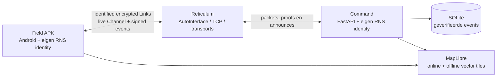

# RETICOM

<p align="center">
  <strong>Map-first teamcommunicatie over het echte Reticulum-netwerk.</strong><br>
  Locatie, push-to-talk, berichten en tactische informatie in één donker field interface.
</p>

<p align="center">
  
  
  
</p>

<p align="center">
  <sub>Live contactprojectie · snelle kaartacties · 22 tactische markertypen</sub>
</p>

Reticom is een tactisch teamplatform voor Android en laptop. Een Field-operator draagt de kaart, PTT en teaminformatie op de telefoon. Command ziet het complete operationele beeld, beheert het team en kan berichten, audio, opdrachten en kaartobjecten versturen.

Dit is geen UI-demo met gesimuleerde peers. De huidige build gebruikt echte Reticulum-identiteiten, destinations, announces, Links, Channels, signatures en delivery proofs. Er wordt bewust geen voorbeelddata toegevoegd: wat op het scherm staat, is werkelijk ontvangen of lokaal op dit apparaat gemaakt.

> **Productrichting:** eenvoudig, tactisch en praktisch. Donker genoeg voor nachtgebruik en OLED, snel genoeg om onder druk met één hand te bedienen.

## De essentie

- **De kaart is het hoofdscherm.** Teamposities, beweging, waypoints, meldingen en opdrachten komen samen in één operationeel beeld.
- **Praten is invoer.** PTT-audio wordt live verstuurd waar mogelijk en valt automatisch terug op een betrouwbare audioclip. Transcripties kunnen tactische meldingen op de kaart zetten.
- **Tekst wordt kaartinformatie.** `contact north 100 meters` tekent vanuit de positie van de melder een rode richting en een vijandmarkering.
- **Iedere operator heeft een identiteit.** Callsigns zijn leesbare labels; de Reticulum identity hash blijft het cryptografische anker.
- **Internet is niet hetzelfde als cloudafhankelijkheid.** Reticom kan via lokale Wi-Fi, een Reticulum-route over 4G/5G en gedownloade offline kaarten blijven functioneren zonder centrale SaaS-backend.

## Zo gebruik je Reticom

### 1. Maak of join een team

Command en Field kunnen allebei een team maken en hosten. Field kan daarnaast:

- een checksummed joincode invoeren;
- de lokale QR-code scannen;
- een recent Reticulum team-announce op het bereikbare netwerk kiezen.

De host is automatisch team-admin. Via **Admin Settings**, direct naast User Settings, kan de host modules beheren, communicatiegeschiedenis wissen en optioneel alle teamleden adminrechten geven.

Zonder team blijft de operationele interface dicht. Een geconfigureerde Reticulum-route is transport, geen automatisch teamlidmaatschap.

### 2. Werk vanuit de kaart

De mobiele kaart toont bovenaan de teamnaam, MGRS-positie, Reticulum-status en een numeriek kompas. Waypoints en contacten verschijnen als richtingindicator op dat kompas. Vanuit de eigen locatie loopt een transparante zichtlijn in de richting waarin de telefoon kijkt.

Een lange druk met één vinger opent het radiale menu. Pinchen en tweevingerbediening blijven gewoon beschikbaar voor navigatie. Op desktop opent rechtsklikken een compact contextmenu.

Vanuit het kaartmenu plaats je ondertekende:

- waarschuwingen, observaties, obstakels en automatisch genummerde waypoints;
- tekst, pijlen, freehand traces en voertuig-/luchtvaartsymbolen;
- medische, logistieke, dreigings-, infrastructuur- en controlemarkers.

Handmatig geplaatste markers blijven staan tot iemand met voldoende rechten ze verwijdert. Automatisch afgeleide meldingen hebben juist een toepasselijke vervaltijd.

### 3. Zend zonder van context te wisselen

Onderaan de kaart staat PTT. De Intel-feed heeft dezelfde PTT-knop plus een compacte berichtenbalk. In Ops kies je een geverifieerde operator voor een privégesprek of private PTT.

Binnenkomende tekst kan met native TTS worden uitgesproken. Audio speelt automatisch af wanneer alerts zijn ingeschakeld. Een korte radiosound sluit direct aan vóór en na inkomende TTS of audio; handmatig terugluisteren gebruikt die sounds niet.

## Van gesproken melding naar operationeel beeld

Reticom herkent niet alleen `contact north 100 meters`, maar een complete set beknopte veldmeldingen.

| Melding | Resultaat op de kaart |
| --- | --- |
| `Road blocked 200 metres east` | Obstacle en geblokkeerde route/richting |
| `Casualty at my position` | Medische marker met melder en tijd |
| `Need evacuation here` / `Evac point` | EVAC-marker |
| `Rally point at the church` | Rally point, waar nodig als benadering |
| `Checkpoint established here` | Checkpoint bij de rapporterende unit |
| `Landing zone clear, 300 metres south` | LZ met status en richting |
| `Vehicle disabled at my position` | Uitgeschakeld voertuig |
| `Unit moving northeast` | Bewegingspijl vanaf de operator |
| `Possible movement northwest` | Onzekerheidssector in plaats van exact doel |
| `Drone spotted west, 500 metres` | UAV-observatie met richting |
| `Fire or smoke southeast` | Hazard plus effectgebied |
| `Radio dead zone here` | Communicatiewaarschuwing |
| `Supply cache at this location` | Supply/logistics marker |
| `Water available here` | Water/sustainment marker |
| `Route Alpha compromised` | Rode routewaarschuwing |
| `Bridge damaged` | Beschadigde infrastructuur |
| `Search this area` | Zoekgebied verdeeld in sectoren |
| `Last seen here ten minutes ago` | Vervagende last-known-position |
| `Hold north of this road` | Tijdelijke hold line |
| `Cancel last contact` | Verwijdert de nieuwste automatische melding van die spreker |

Een richtingprojectie wordt alleen gemaakt wanneer de melder een recente, betrouwbare positie heeft. Een onoplosbare landmark- of wegverwijzing blijft zichtbaar als benadering; Reticom verzint geen precieze coördinaat.

## De rest van de mobiele workflow

<p align="center">
  
  
  
</p>

<p align="center">
  <sub>Vector of satelliet · complete Intel-feed · geverifieerde operators en directe chat</sub>
</p>

### Map

- donkere vector- en satellietweergave;
- wereldwijd MGRS/UPS-grid met kopieerbare referentie;
- live operatorposities en gestabiliseerde bewegingstrails;
- straight-line en berekende route naar waypoint of operator, beide binnen Reticom;
- swipebare recente inkomende berichten boven de kaart; je eigen verzendingen blijven alleen in de Intel-feed;
- offline vector map packs voor het zichtbare gebied.

### Feed

- team- en privéberichten in één chronologisch Intel-overzicht;
- PTT met een eenvoudige waveformspeler en transcript eronder;
- optionele opdrachtenmodule;
- cryptografisch bewijs, packet hash en transportbron beschikbaar bij gebeurtenissen;
- geen ruis van iedere normale positie-update.

### Ops

- geverifieerde operators gegroepeerd op Reticulum-identiteit;
- callsign, symbool, kleur en laatste activiteit;
- navigeren naar een operator;
- directe privéchat en private PTT.

## Command Center

De laptopinterface is ingericht als operationele werkplek:

- team, joincode/QR, modules en geverifieerde operators links;
- een brede operationele kaart met kaartbewerking bovenin;
- teamtekst en Command-PTT compact onder de kaart;
- opdrachten en ontvangen Intel daarnaast;
- verwijderen van teamcommunicatie zonder kaart, taken of operators weg te gooien;
- optionele teammodus waarin iedere deelnemer andermans berichten, markers en drawings mag verwijderen.

Command heeft een eigen persistente Reticulum-identiteit. Berichten en audio worden dus niet namens een generieke server verstuurd, maar zijn als Command ondertekend.

## Wat er onder de motorkap gebeurt



### Twee echte nodes

De lokale ontwikkelopstelling start twee onafhankelijke processen:

- **Command** op `http://127.0.0.1:8780`;
- **Field** op `http://127.0.0.1:8781`.

Beide gebruiken een eigen Reticulum-configuratiedirectory en identiteit. Lokaal kruist verkeer een `TCPClientInterface → TCPServerInterface` carrier op `127.0.0.1:4242`. Dat is geen HTTP-shortcut tussen de twee UI's: het event wordt geserialiseerd, ondertekend, over Reticulum geleverd, geverifieerd en pas daarna in Command opgeslagen.

Op afzonderlijke apparaten gebruikt Reticom `AutoInterface` voor bereikbare Ethernet/Wi-Fi-peers en TCP-interfaces voor routes over internet. De Android-build bevat een kleine bootstrap-pool in meerdere regio's en kan in Advanced Network een eigen vertrouwde node gebruiken. Tailscale of een ander VPN is niet vereist.

### Eventstroom

1. Field maakt bijvoorbeeld een `chat.message`, `position.updated` of `marker.created` event.
2. Coördinaten en compacte velden worden genormaliseerd.
3. Field slaat het event direct per team op en toont het als `LOCAL · QUEUED`; daarvoor is geen Command-pad nodig.
4. Zodra de teamdestination bereikbaar is, wordt het event met de persistente Field-identiteit ondertekend.
5. Een identified Reticulum Link of Channel transporteert het event.
6. De ontvangende teamhost controleert identiteit, signature en eventvorm.
7. Alleen geldige ontvangen events komen in de geverifieerde SQLite-feed.
8. De lokale outbox markeert het event na bevestiging als geleverd.
9. Field haalt de gedeelde feed, taken, privéberichten en audio via een identified encrypted Link op.

Iedere weergegeven netwerkgebeurtenis kan een sender identity, packet hash, delivery proof en ontvangende interface tonen.

## Communicatie, audio en transcriptie

### Team-PTT

Bij een actieve Field-link houdt Reticom een geauthenticeerd Reticulum Channel open. Lage-bitrate Opus/WebM-fragmenten worden verzonden terwijl iemand praat, zodat afspelen na een kleine buffer kan beginnen. Valt de live route weg, dan gebruikt dezelfde hold automatisch de bewezen clip-overdracht van maximaal acht seconden.

Een swipe annuleert een nog gebufferde opname. Bij een al lopende live uitzending stopt dit toekomstige audio, maar kan reeds ontvangen geluid uiteraard niet worden ingetrokken.

### Private communicatie

Private tekst en PTT zijn alleen zichtbaar voor verzender en geadresseerde Field-identiteit. Command fungeert als vertrouwde mailbox/relay voor tijdelijk offline ontvangers. Dit is dus versleuteld Reticulum-verkeer, maar **geen end-to-end model dat Command cryptografisch buitensluit**.

### Transcriptie en TTS

Command gebruikt lokaal `faster-whisper`. Clips worden niet naar een cloudtranscriptiedienst gestuurd. Resultaten worden per clip en audiohash gecachet. Android gebruikt een gekozen native TTS-stem voor binnenkomende berichten, opdrachten en privécommunicatie, ook wanneer de app via de foreground service op de achtergrond draait.

De standaard transcriptietaal is Engels, omdat automatische detectie bij zeer korte radiofragmenten onbetrouwbaar kan zijn:

```powershell
$env:RETIUM_TRANSCRIPTION_LANGUAGE = "nl"     # Nederlands
$env:RETIUM_TRANSCRIPTION_LANGUAGE = "auto"   # automatische detectie
$env:RETIUM_TRANSCRIPTION_MODEL = "base"      # standaardmodel
```

## Locatie, kaarten en navigatie

- Tijdens beweging wordt maximaal iedere 15 seconden een fix verstuurd; stilstaand volgt een heartbeat na 60 seconden.
- De eigen GPS-positie verschijnt lokaal op de kaart, ook wanneer de teamdestination offline is en zonder de positie automatisch te delen.
- Berichten, markers, tekeningen, positie-updates en opgenomen team-PTT worden direct lokaal opgeslagen. Ze blijven bruikbaar en gaan in een persistente Reticulum-outbox totdat de teamhost weer bereikbaar is.
- De outbox bewaart bij langdurige offline beweging alleen de nieuwste nog niet verstuurde positiefix; lokale historie blijft wel op de kaart beschikbaar.
- Fixes slechter dan 100 meter worden niet verzonden.
- De zichtbare trail weegt accuracy mee, filtert fixes slechter dan 150 meter en isoleert onwaarschijnlijke GPS-sprongen.
- Een plotselinge verplaatsing wordt pas gebruikt na een tweede consistente fix.
- De trail bevat maximaal 48 punten uit de laatste 30 minuten en verdwijnt tien minuten na de nieuwste fix.
- Routinefixes blijven uit de Intel-feed. `OPERATOR ACTIVE` verschijnt alleen wanneer locatie delen na meer dan een uur weer actief wordt.
- Waypoint-arrival gebruikt een accuracy-aware radius van minimaal 35 meter en negeert fixes slechter dan 75 meter.
- Berekende routes worden als routegeometrie in Reticom getekend; bij een routingfout blijft de directe lijn beschikbaar.

Offline map packs bevatten de zichtbare vector tiles plus veelgebruikte labelglyphs, met een veiligheidslimiet van 2.500 tiles per download. MGRS/UPS-berekening en Reticulum-overlays blijven onafhankelijk van internet. Satellietbeelden zijn online-only, omdat de huidige imagery-provider bulkopslag niet toestaat.

## Security- en trustmodel

Wat Reticom wél doet:

- persistente cryptografische identiteit per Command- en Field-node;
- ontvangen Reticulum-events worden vóór opslag en weergave cryptografisch geverifieerd;
- eigen nog niet verzonden events zijn expliciet gemarkeerd als lokaal en queued en worden bij transport ondertekend;
- identified encrypted Reticulum Links voor feed, audio, taken en privéverkeer;
- geauthenticeerde live Channels voor PTT;
- signed tombstones voor verwijderde berichten en kaartobjecten;
- lokale opslag van identity en data per node.

Belangrijke grenzen:

- Command is een vertrouwde relay en kan private mailboxinhoud verwerken;
- publieke TCP-entrypoints kunnen IP-adressen, timing en verkeersvolume zien, maar niet de beschermde application payload;
- community nodes zijn externe infrastructuur en kunnen verdwijnen;
- de huidige MVP heeft nog geen Command-side member approval of key revocation;
- Bluetooth proximity wordt niet gesimuleerd en vereist een native Reticulum-capable bearer.

## Lokaal starten op Windows

Vereisten: Windows, Python 3.11+ en PowerShell.

```powershell
py -m venv .venv
.\.venv\Scripts\python -m pip install -e .
.\start-local.ps1
```

Open daarna:

- Command: <http://127.0.0.1:8780>
- Field: <http://127.0.0.1:8781>

Controleer met één echte Reticulum round-trip:

```powershell
.\smoke-test.ps1
```

De smoke-test verstuurt een ondertekend event vanaf Field, wacht tot Command exact dat event via Reticulum ontvangt en rapporteert delivery status, RTT, bytes, sender identity, packet hash en receiving interface.

Stop beide processen met:

```powershell
.\stop-local.ps1
```

Runtimebestanden en logs komen in `runtime/`. De scripts weigeren te starten wanneer de gekozen poorten of de lokale Reticulum-carrier al bezet zijn.

## Android APK bouwen

De APK is een zelfstandige Field-node. De telefoon bedient dus niet simpelweg de Windows-webserver: Python, Reticulum, de persistente identity, lokale opslag, background alerts en de Field-UI zitten in de app.

Vereisten: Windows, WSL 2 en een ARM64-telefoon met Android 8.0 of nieuwer.

```powershell
.\build-android.ps1
```

De eerste build downloadt een geïsoleerde Java-, Python-, Gradle- en Android SDK-toolchain in WSL. De output staat hier:

```text
Reticom-Field-0.1.0-debug.apk
```

Een expliciete eigen transportnode kan tijdens de build worden meegegeven:

```powershell
.\build-android.ps1 -TransportHost rns.example.org -TransportPort 4242
```

Een lokale versiebuild gebruikt expliciete Android-versiemetadata:

```powershell
.\build-android.ps1 -VersionName 0.2.0 -VersionCode 2000
```

Normaal is dit niet nodig: Field Settings → Advanced Network accepteert ook na installatie een gekozen hostname/IP en poort, terwijl de community bootstrap-pool als fallback beschikbaar blijft. Herstart Reticom volledig na een netwerkwijziging.

De interne Python-package, Android application ID, browser storage keys en destination aspect heten om compatibiliteitsredenen nog `retium`. Hierdoor kan een bestaande installatie in-place upgraden zonder identity, teamroute en gebruikersinstellingen te verliezen.

## Windows Command-app bouwen

`Reticom-Command.exe` is een zelfstandige lichte Windows-app voor Command. De executable bevat Python, FastAPI, Reticulum en de volledige Command-interface, maar gebruikt de bestaande Microsoft Edge WebView2-runtime van Windows in plaats van een complete browser mee te bundelen.

Vereisten voor de build: Windows en Python 3.11. Gebruikers van de gebouwde executable hoeven Python niet te installeren.

```powershell
.\build-windows.ps1 -Version 0.2.0
```

De uitvoer staat in `dist/`:

```text
Reticom-Command-0.2.0-windows-x64.exe
Reticom-Command-0.2.0-windows-x64.exe.sha256
```

De applicatie opent in een eigen venster zonder console. Persistente Reticulum-identiteiten, teamdata, offline kaarten en logs staan onder `%LOCALAPPDATA%\Reticom`; ze worden niet naast de executable geschreven.

## Ontwikkelaarsgids

### Projectstructuur

```text
retium/
├─ src/retium/
│  ├─ server.py              FastAPI, HTTP/WebSocket API en rolstart
│  ├─ protocol.py            Eventvalidatie, normalisatie en limieten
│  ├─ transport.py           Reticulum destinations, Links en delivery
│  ├─ live_voice.py          Reticulum Channel voor live PTT
│  ├─ store.py               SQLite-eventopslag
│  ├─ outbox.py              Persistente lokale Field-wachtrij
│  ├─ team.py                Teams, announces, join en modules
│  ├─ tasks.py               Opdrachten
│  ├─ ptt.py                 Audioclips en metadata
│  ├─ transcription.py       Lokale Whisper-transcriptie
│  ├─ offline_maps.py        Tilepacks en lokale mapserver
│  ├─ desktop.py             Lichte Windows Command-launcher
│  └─ static/
│     ├─ app.js              Field + Command clientlogica
│     ├─ automatic-reports.js Spraak/tekst → tactische geometrie
│     ├─ marker-catalog.js    Handmatige tactische markertypen
│     ├─ location-filter.js   Accuracy filtering en jump quarantine
│     ├─ route-navigation.js  In-app routeberekening
│     ├─ index.html
│     └─ styles.css
├─ android/app/src/main/
│  ├─ java/com/retium/field/ Native WebView, service, locatie en TTS
│  └─ python/mobile_main.py   On-device Reticom-server
├─ windows/                   PyInstaller-configuratie
├─ scripts/                   Gegenereerde Windows icon/version resources
├─ configs/                   Losse Command- en Field-RNS-configs
├─ tests/                     Python- en browserlogica-tests
├─ start-local.ps1
├─ smoke-test.ps1
├─ build-android.ps1
└─ build-windows.ps1
```

### Testen

```powershell
.\.venv\Scripts\python.exe -m pytest -q
node --test tests/*.test.mjs
.\smoke-test.ps1
```

De tests dekken onder andere:

- protocolvalidatie, signatures, packetlimieten en tombstones;
- tasks, teamrechten, private mailbox en waypoint-arrival;
- automatische tactische reports en geometrie;
- GPS accuracy filtering en teleport-quarantine;
- map view preservation, MGRS, kompas en routeberekening;
- alle 22 handmatige tactische markertypen.

Een Android-wijziging is pas klaar na een echte build, installatie met `adb install -r` en controle op een fysiek toestel. Browser-only succes bewijst geen permissies, foreground service, native TTS, microfoon of achtergrondalerts.

### Een applicatierelease publiceren

Push een SemVer-tag die met `v` begint. GitHub Actions bouwt parallel een versiegebonden Android debug-APK en een standalone Windows Command-executable. De release wordt pas gepubliceerd wanneer beide builds en hun smoke-tests slagen. APK, EXE en beide SHA-256-bestanden komen bij dezelfde GitHub Release:

```powershell
git tag v0.2.0
git push origin v0.2.0
```

Gebruik iedere versietag maar één keer. `vMAJOR.MINOR.PATCH` wordt Android `versionName`; de workflow berekent een oplopende `versionCode` uit dezelfde drie getallen.

### Een nieuw eventtype toevoegen

1. Definieer en valideer het compacte event in `src/retium/protocol.py`.
2. Voeg opslag-/weergavegedrag toe zonder ongeverifieerde velden te vertrouwen.
3. Houd Reticulum packetlimieten in gedachten; gebruik een Link voor grotere payloads.
4. Voeg Python-tests toe voor geldige en ongeldige events.
5. Voeg clienttests toe wanneer parsing, geometrie of state in JavaScript zit.
6. Test de echte Field → Reticulum → Command round-trip.

### Een nieuw automatisch kaartcommando toevoegen

1. Voeg de kleinste ondubbelzinnige taalregels toe aan `automatic-reports.js`.
2. Gebruik de meest recente betrouwbare positie van de spreker als referentie.
3. Maak onzekerheid zichtbaar; verzin geen precieze locatie.
4. Kies een passende TTL en cancel-semantiek.
5. Voeg de handmatige variant toe aan `marker-catalog.js` wanneer operators die ook vanuit het kaartmenu moeten kunnen plaatsen.
6. Test zowel tekst als het transcriptpad van PTT.

## Status en scope

Reticom is een werkende vertical slice en veldprototype, geen gecertificeerd command-and-controlproduct. Het bewijst de applicatielaag op echte Reticulum-infrastructuur en een echte Android-node, maar deployment-hardening, formeel keybeheer, groepsrekeying, member approval/revocation, offline satellietbeelden en een native Bluetooth-bearer staan nog buiten deze MVP.

LoRa/RNode vereist geen nieuw eventmodel of nieuwe UI. Vervang of voeg een correct geconfigureerde `RNodeInterface` toe en zorg dat een compatibele peer/transport de Command destination kan bereiken.

## Gebundelde componenten

- `geographiclib-mgrs`: MIT, inclusief originele GeographicLib-licentie onder `src/retium/static/vendor/geographiclib-mgrs/`.
- MapLibre GL JS: BSD-3-Clause, licentie onder `src/retium/static/vendor/maplibre-gl/`.

## Licentie

Copyright © 2026 [m-a-x-s-e-e-l-i-g](https://github.com/m-a-x-s-e-e-l-i-g).

Reticom is beschikbaar onder de [Creative Commons Attribution-NonCommercial-NoDerivatives 4.0 International-licentie](LICENSE). Je mag het project delen met naamsvermelding, uitsluitend niet-commercieel en zonder gewijzigde versies te verspreiden. De volledige juridische tekst staat in `LICENSE`.
